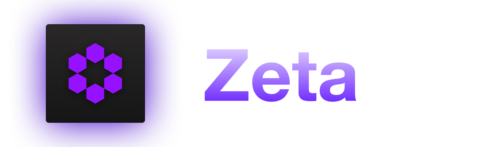

[](https://discord.gg/qUtxnK2NMf)


Build High-performance, agile, and scalable AI models with modular and re-useable building blocks!


[](https://zeta.readthedocs.io)

<p>
  <a href="https://github.com/kyegomez/zeta/blob/main/LICENSE"></a>
  <a href="https://pypi.org/project/zetascale"></a>
</p>

# Design Principles
- Fluid Experimentation: Zeta aims to be effortless for researchers and industrial AI engineers to rapidly experiment with the latest modules and components like `MultiGroupedQueryAttention` or `Unet` and many others!
- Production-Grade Reliability: Facilitate reproducibility with bleeding-edge performance.
- Modularity: Modularized Lego Building Blocks for building and deploying the best ML Models!


# 🤝 Schedule a 1-on-1 Session
Book a [1-on-1 Session with Kye](https://calendly.com/apacai/agora), the Creator, to discuss any issues, provide feedback, or explore how we can improve Zeta for you.


## Installation

`pip install zetascale`

## Initiating Your Journey

Creating a model empowered with the aforementioned breakthrough research features is a breeze. Here's how to quickly materialize the renowned Flash Attention

```python
import torch
from zeta.nn.attention import FlashAttention

q = torch.randn(2, 4, 6, 8)
k = torch.randn(2, 4, 10, 8)
v = torch.randn(2, 4, 10, 8)

attention = FlashAttention(causal=False, dropout=0.1, flash=True)
output = attention(q, k, v)

print(output.shape) 

```

### ```RelativePositionBias```
- ```RelativePositionBias``` quantizes the distance between two positions into a certain number of buckets and then uses an embedding to get the relative position bias. This mechanism aids in the attention mechanism by providing biases based on relative positions between the query and key, rather than relying solely on their absolute positions.
```python
from zeta.nn import RelativePositionBias
import torch

# Initialize the RelativePositionBias module
rel_pos_bias = RelativePositionBias()

# Example 1: Compute bias for a single batch
bias_matrix = rel_pos_bias(1, 10, 10)

# Example 2: Utilize in conjunction with an attention mechanism
# NOTE: This is a mock example, and may not represent an actual attention mechanism's complete implementation.
class MockAttention(nn.Module):
    def __init__(self):
        super().__init__()
        self.rel_pos_bias = RelativePositionBias()

    def forward(self, queries, keys):
        bias = self.rel_pos_bias(queries.size(0), queries.size(1), keys.size(1))
        # Further computations with bias in the attention mechanism...
        return None  # Placeholder

# Example 3: Modify default configurations
custom_rel_pos_bias = RelativePositionBias(bidirectional=False, num_buckets=64, max_distance=256, n_heads=8)

```

### `FeedForward`
The FeedForward module performs a feedforward operation on the input tensor x. It consists of a multi-layer perceptron (MLP) with an optional activation function and LayerNorm. 

```python
from zeta.nn import FeedForward

model = FeedForward(
  256, 
  512, 
  glu=True, 
  post_act_ln=True, 
  dropout=0.2
)

x = torch.randn(1, 256)

output = model(x)
print(output.shape)
```

### `BitLinear`
- The BitLinear module performs linear transformation on the input data, followed by quantization and dequantization. The quantization process is performed using the absmax_quantize function, which quantizes the input tensor based on the absolute maximum value, [from the paper](https://arxiv.org/abs/2310.11453)
```python
import torch
from torch import nn
import zeta.quant as qt

class MyModel(nn.Module):
    def __init__(self):
        super(MyModel, self).__init__()
        self.linear = qt.BitLinear(10, 20)

    def forward(self, x):
        return self.linear(x)

# Initialize the model
model = MyModel()

# Create a random tensor of size (128, 10)
input = torch.randn(128, 10)

# Perform the forward pass
output = model(input)

# Print the size of the output
print(output.size())  # torch.Size([128, 20])

```

### `PalmE`
- This is an implementation of the multi-modal Palm-E model using a decoder llm as the backbone with an VIT image encoder to process vision, it's very similiar to GPT4, Kosmos, RTX2, and many other multi-modality model architectures

```python
import torch
from zeta.structs import (
  AutoregressiveWrapper,
  Decoder,
  Encoder,
  Transformer,
  ViTransformerWrapper,
)


class PalmE(torch.nn.Module):
    """
    PalmE is a transformer architecture that uses a ViT encoder and a transformer decoder.

    Args:

        image_size (int): Size of the image.
        patch_size (int): Size of the patch.
        encoder_dim (int): Dimension of the encoder.
        encoder_depth (int): Depth of the encoder.
        encoder_heads (int): Number of heads in the encoder.
        num_tokens (int): Number of tokens.
        max_seq_len (int): Maximum sequence length.
        decoder_dim (int): Dimension of the decoder.
        decoder_depth (int): Depth of the decoder.
        decoder_heads (int): Number of heads in the decoder.
        alibi_num_heads (int): Number of heads in the alibi attention.
        attn_kv_heads (int): Number of heads in the attention key-value projection.
        use_abs_pos_emb (bool): Whether to use absolute positional embeddings.
        cross_attend (bool): Whether to cross attend in the decoder.
        alibi_pos_bias (bool): Whether to use positional bias in the alibi attention.
        rotary_xpos (bool): Whether to use rotary positional embeddings.
        attn_flash (bool): Whether to use attention flash.
        qk_norm (bool): Whether to normalize the query and key in the attention layer.

    Returns:

            torch.Tensor: The output of the model.

    Usage:

            >>> img = torch.randn(1, 3, 256, 256)
            >>> text = torch.randint(0, 20000, (1, 1024))
            >>> model = PalmE()
            >>> output = model(img, text)
            >>> print(output)

    """

    def __init__(
        self,
        image_size=256,
        patch_size=32,
        encoder_dim=512,
        encoder_depth=6,
        encoder_heads=8,
        num_tokens=20000,
        max_seq_len=1024,
        decoder_dim=512,
        decoder_depth=6,
        decoder_heads=8,
        alibi_num_heads=4,
        attn_kv_heads=2,
        use_abs_pos_emb=False,
        cross_attend=True,
        alibi_pos_bias=True,
        rotary_xpos=True,
        attn_flash=True,
        qk_norm=True,
    ):
        super(PalmE, self).__init__()

        # vit architecture
        self.encoder = ViTransformerWrapper(
            image_size=image_size,
            patch_size=patch_size,
            attn_layers=Encoder(
                dim=encoder_dim, depth=encoder_depth, heads=encoder_heads
            ),
        )

        # palm model architecture
        self.decoder = Transformer(
            num_tokens=num_tokens,
            max_seq_len=max_seq_len,
            use_abs_pos_emb=use_abs_pos_emb,
            attn_layers=Decoder(
                dim=decoder_dim,
                depth=decoder_depth,
                heads=decoder_heads,
                cross_attend=cross_attend,
                alibi_pos_bias=alibi_pos_bias,
                alibi_num_heads=alibi_num_heads,
                rotary_xpos=rotary_xpos,
                attn_kv_heads=attn_kv_heads,
                attn_flash=attn_flash,
                qk_norm=qk_norm,
            ),
        )

        # autoregressive wrapper to enable generation of tokens
        self.decoder = AutoregressiveWrapper(self.decoder)

    def forward(self, img: torch.Tensor, text: torch.Tensor):
        """Forward pass of the model."""
        try:
            encoded = self.encoder(img, return_embeddings=True)
            return self.decoder(text, context=encoded)
        except Exception as error:
            print(f"Failed in forward method: {error}")
            raise

# Usage with random inputs
img = torch.randn(1, 3, 256, 256)
text = torch.randint(0, 20000, (1, 1024))

# Initiliaze the model
model = PalmE()
output = model(img, text)
print(output)


```


### `Unet`
Unet is a famous convolutional neural network architecture originally used for biomedical image segmentation but soon became the backbone of the generative AI Mega-revolution. The architecture comprises two primary pathways: downsampling and upsampling, followed by an output convolution. Due to its U-shape, the architecture is named U-Net. Its symmetric architecture ensures that the context (from downsampling) and the localization (from upsampling) are captured effectively.

```python
import torch
from zeta.nn import Unet  

# Initialize the U-Net model
model = Unet(n_channels=1, n_classes=2)

# Random input tensor with dimensions [batch_size, channels, height, width]
x = torch.randn(1, 1, 572, 572)

# Forward pass through the model
y = model(x)

# Output
print(f"Input shape: {x.shape}")
print(f"Output shape: {y.shape}")


```


### `VisionEmbeddings`
The VisionEmbedding class is designed for converting images into patch embeddings, making them suitable for processing by transformer-based models. This class plays a crucial role in various computer vision tasks and enables the integration of vision data into transformer architectures!

```python
from zeta.nn import VisionEmbedding
import torch

# Create an instance of VisionEmbedding
vision_embedding = VisionEmbedding(
  img_size=224,
  patch_size=16,
  in_chans=3,
  embed_dim=768,
  contain_mask_token=True,
  prepend_cls_token=True,
)

# Load an example image (3 channels, 224x224)
input_image = torch.rand(1, 3, 224, 224)

# Perform image-to-patch embedding
output = vision_embedding(input_image)

# The output now contains patch embeddings, ready for input to a transformer model
```

# Documentation
[Click here for the documentation, it's at zeta.apac.ai](https://zeta.apac.ai)


## Contributing
- We need you to help us build the most re-useable, reliable, and high performance ML framework ever.

- [Check out the project board here!](https://github.com/users/kyegomez/projects/7/views/2)

- We need help writing tests and documentation!


# License 
- MIT